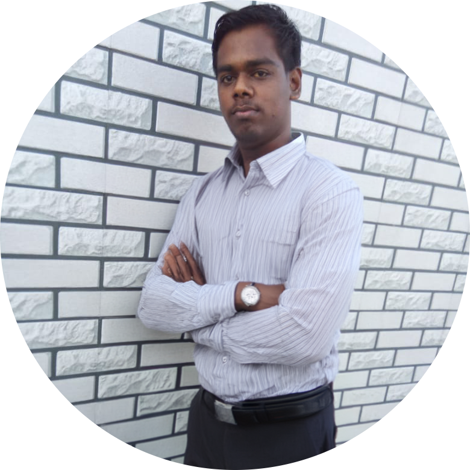
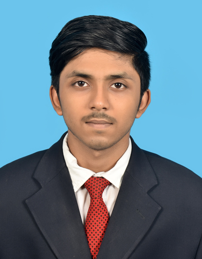
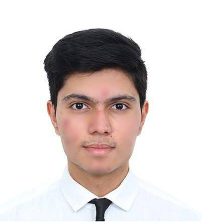

## Welcome to OWASP Sivagangai
We are thrilled to introduce **OWASP Sivagangai**, a local chapter committed to empowering the community in the evolving fields of **AI** and **application security**. As technology advances, the convergence of artificial intelligence and cybersecurity brings both opportunities and challenges. Our mission is to provide a collaborative platform for learning, innovation, and securing AI-driven applications while safeguarding sensitive data.

Whether you're an experienced professional or a beginner in AI and security, our chapter offers a supportive environment for networking, knowledge-sharing, and professional development. Through meetups, workshops, and collaborative projects, we aim to build a strong, security-focused community equipped to tackle emerging threats and leverage AI to create resilient systems.

Join us as we explore cutting-edge topics, share best practices, and contribute to securing the future of AI and applications together.

---

## Our Vision
To create a secure digital future by empowering individuals and organizations with the knowledge and tools to tackle the ever-evolving cybersecurity challenges.

---

## Why Join Us?
- Stay updated on the latest trends in AI and application security.
- Learn from industry experts through workshops and talks.
- Build your professional network in the cybersecurity community.
- Contribute to open-source projects and make a global impact.

---

## Participation
The **Open Worldwide Application Security Project (OWASP)** is a nonprofit foundation dedicated to improving software security. All our projects, tools, documents, forums, and chapters are free and open to everyone interested in enhancing application security.

Chapters are led by local leaders in accordance with the [Chapters Policy](/www-policy/operational/chapters). Financial contributions should only be made online using the authorized online donation button.

---

## Chapter Leaders

    
  <b>Arun P</b>

 

    
  <b>Ganesh Chidambaram</b>

---

## Chapter Members

    
  <b>KP Gowtham Anirudh</b>

 

---

## Connect with Us
- [Follow us on LinkedIn](#)
- [Join our Meetup Group](#)
- [Subscribe to our Newsletter](#)

---

## Current Focus Areas
- Exploring AI's role in cybersecurity.
- Developing secure coding practices.
- Promoting awareness about application vulnerabilities.

---

## Get Involved
Everyone is welcome and encouraged to participate in our [Projects](https://bit.ly/42LNjA4), [Local Chapters](/chapters/), [Events](/events/), [Online Groups](https://groups.google.com/a/owasp.com/){:target='_blank'}, and [Community Slack Channel](https://owasp.slack.com/){:target='_blank'}. Diversity is at the heart of our initiatives, and OWASP is a fantastic place to learn about application security, network with experts, and grow your reputation in the field.

Consider becoming a [member](/membership/) or making a [donation](/donate/) to support our ongoing efforts.

---

## Ready to Secure the Future?
Join us today and be part of the global effort to make the digital world a safer place. [Contact Us](#) or [Attend Our Next Event](#)!

---
## Get Involved
We welcome everyone to participate in our chapter activities and contribute to our projects. Here are a few ways to get involved:
- Attend our [Meetups and Events](#).
- Join our [Slack Community](https://owasp.slack.com/).
- Contribute to our open-source project **IOT Guide** with owasp [Fill the gform](https://forms.gle/88xUTQt7eQi7MeCb9)
---
## Next Meeting/Event

