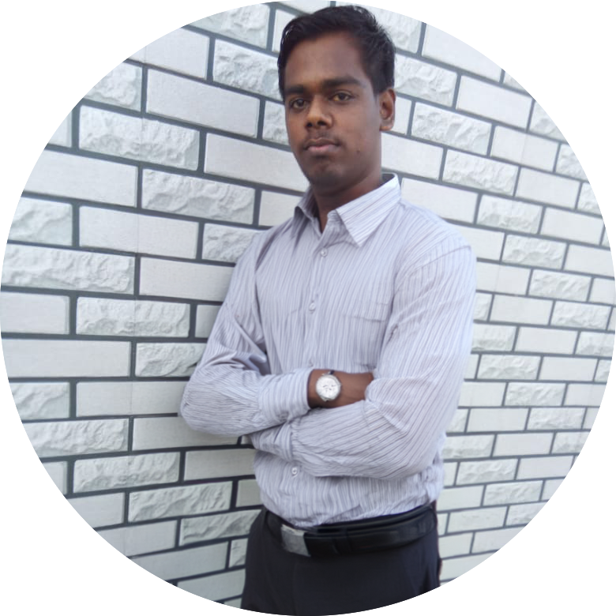

---

layout: col-sidebar
title: OWASP Sivagangai
tags: example-tag
region: Asia
country: India
meetup-group:

---
## Welcome
We are excited to announce the launch of our local OWASP chapter OWASP Sivagangai, dedicated in empowering the community in the rapidly evolving fields of AI and application security. As technology advances, the intersection of artificial intelligence and cybersecurity presents both opportunities and challenges. Our mission is to provide a platform for learning, collaboration, and innovation, ensuring that our community is equipped with the knowledge and skills necessary to secure AI-driven applications and protect sensitive data.

Whether you are a seasoned professional or just beginning your journey in AI and security, our chapter offers a welcoming environment for networking, knowledge-sharing, and professional growth. Through regular meetups, workshops, and collaborative projects, we aim to foster a strong, security-focused community that stays ahead of emerging threats and embraces the potential of AI in creating more secure and resilient systems.

Join us as we work together to explore cutting-edge topics, share best practices, and contribute to the global effort to secure our digital future. Together, we can make a difference in the world of AI and application security!

## Participation
The Open Worldwide Application Security Project (OWASP) is a nonprofit foundation that works to improve the security of software. All of our projects, tools, documents, forums, and chapters are free and open to anyone interested in improving application security. 

Chapters are led by local leaders in accordance with the [Chapters Policy](/www-policy/operational/chapters). Financial contributions should only be made online using the authorized online donation button. 
## Chapter leaders

  <b>Arun P</b>

Everyone is welcome and encouraged to participate in our [Projects](/projects/), [Local Chapters](/chapters/), [Events](/events/), [Online Groups](https://groups.google.com/a/owasp.com/){:target='_blank'}, and [Community Slack Channel](https://owasp.slack.com/){:target='_blank'}. We especially encourage diversity in all our initiatives. OWASP is a fantastic place to learn about application security, to network, and even to build your reputation as an expert. We also encourage you to be [become a member](/membership/) or consider a [donation](/donate/) to support our ongoing work.

Next Meeting/Event <!-- You should keep this section as it will populate your meetup events -->
---------------------


